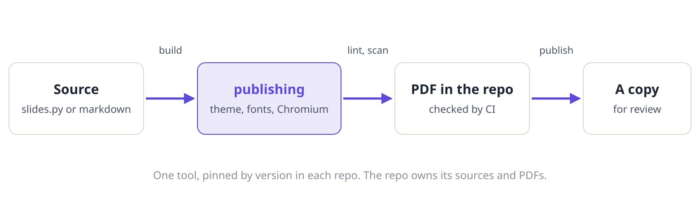

::: summary
### The short version

- **Write markdown.** Front matter gives the title block; the body is ordinary markdown.
- **Use the house blocks.** A summary box, numbered question cards, tables with a source line, and figures with captions.
- **Build and check.** `publishing build` writes the PDF beside its folder; CI runs `publishing check`.
:::

## What a memo holds

A memo is one markdown file, `memo.md`, in a folder named for its topic and version. Pictures and diagrams sit beside it. Reading text is set in Noto Serif; headings, tables and page furniture in Noto Sans; code in Noto Sans Mono. All three are vendored, so the page breaks the same way on every machine.



| Block | Markdown | Renders as |
|---|---|---|
| Summary | `::: summary` ... `:::` | a paper-toned box with a small heading |
| Question | `::: q` with a `###` heading | a card with an accent rule |
| Table source | a paragraph starting `: ` after a table | a small grey line under the table |
| Figure | an image alone in its paragraph | the image with its caption |
| New page | `## Heading {.newpage}` | the heading starts a new page |

: Source: the publishing markdown reader.

Code is highlighted in the house palette:

```toml
# docs/report.toml
publishing = "0.1.0"
project = "Fleet"
```

## Questions

::: q
### 1. Is a memo the right format?
Use a memo when the reader reads top to bottom; use a deck when the argument is a sequence of pictures.

**Recommendation.** A memo for plans and audits, a deck for designs and findings.

**What the answer changes.** Which `publishing new --format` the author starts from.
:::
