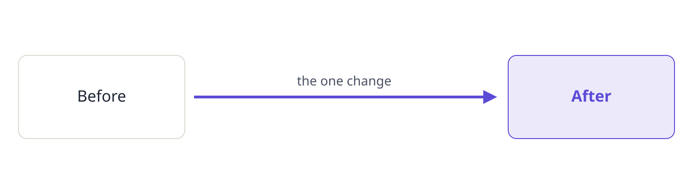

::: summary
### The short version

- **The finding.** Plain English, one idea per line.
- **The recommendation.** What we propose, and why.
- **The ask.** The numbered questions at the end.
:::

## What we found

Write the body here. Tables, code and one simple diagram are welcome.

| Option | Cost | What it changes |
|---|---|---|
| A | low | little |
| B | higher | more |

: Source: say where the numbers come from.

## Questions

::: q
### 1. The first question?
What exactly is being asked.

**Recommendation.** What we recommend.

**What the answer changes.** What changes with each answer.
:::
